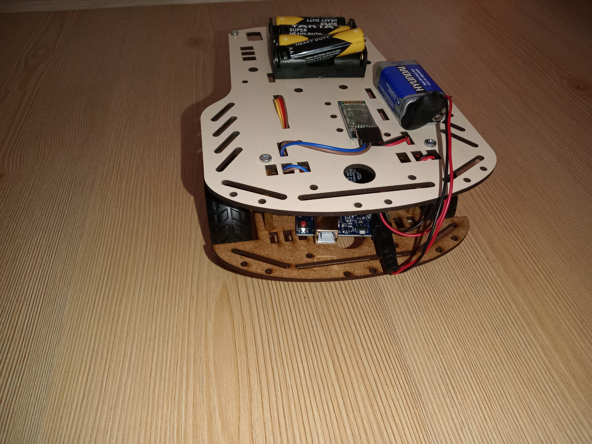
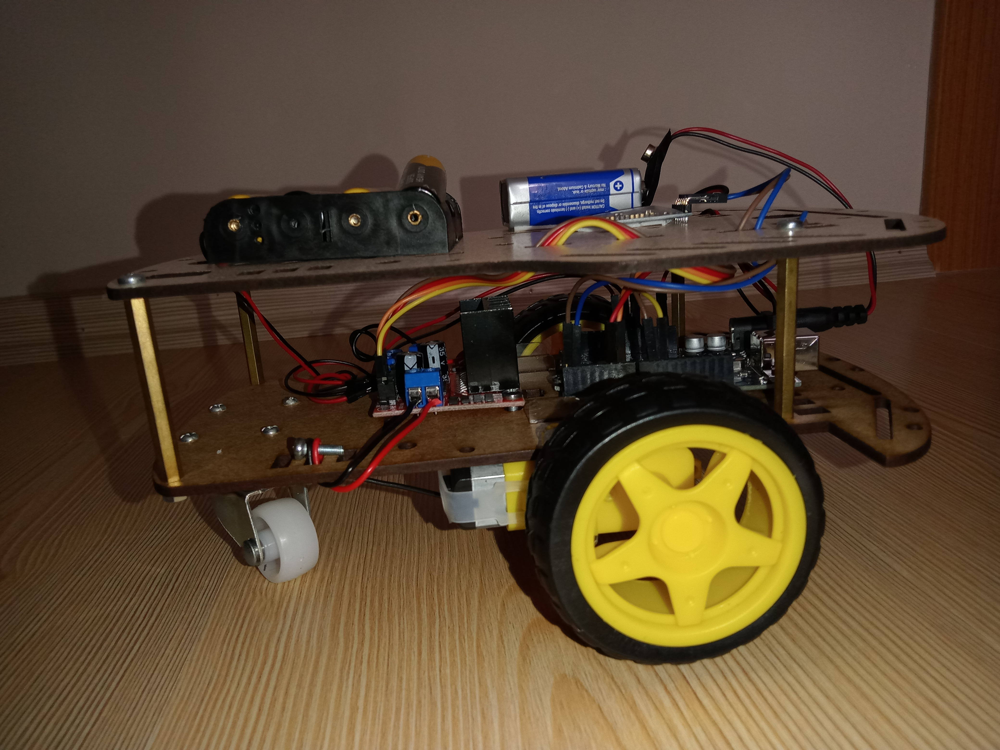
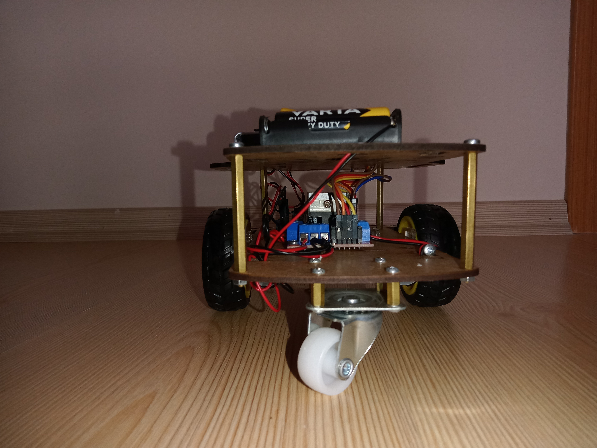

# Arduino-2WD-Bluetooth-Car

### Necessary Hardware
* 2WD Car Kit
* Arduino UNO
* Jumper Wires
* L298N Dual Motor Driver Board
* 1.5V Alkaline Battery 4x
* 9V Battery
* 9V Power Wire
* HC-05 or HC-06 Bluetooth Module
* Android Phone (to control car with bluetooth)

### Bluetooth Module Connections
* Bluetooth RXD --> Arduino UNO TX
* Bluetooth TXD --> Arduino UNO RX
* Bluetooth VCC --> Arduino UNO 5V
* Bluetooth GND --> Arduino UNO GND

### Motor Driver Connections
* Battery Bed Red Wire --> Motor Driver 12V+
* Battery Bed Black Wire --> Motor Driver GND
* Arduino UNO GND --> Motor Driver GND
* Motor Cables --> Motor Driver OUT1 , OUT2 , OUT3 , OUT4

### Project Images

###### Made By Emir Köse
